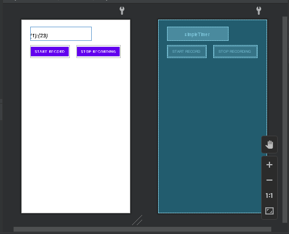
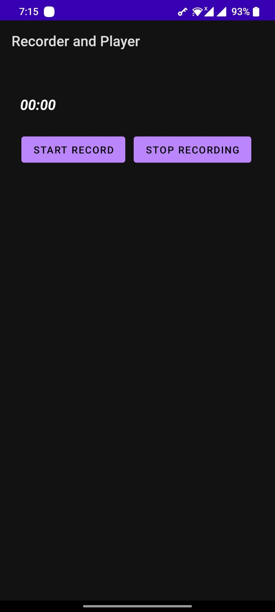

OBOE PLAYER (SIMPLE PROECT) 
======================================

This android application (Native/C++) is created to demonstrate how we can use [Google's Oboe](https://github.com/google/oboe) to record 
audio and play audio file of type .wav.

Used
---------------
1. Used **Kotlin**.
2. Project is based on [AndroidStudio](https://developer.android.com/studio).
3. Used Oboe (A C++ library that makes it easy to build high-performance audio apps on Android).

## USAGE

1. Clone the project 
2. Open project in Android Studio (Make sure to properly configure oboe lib)
3. Run 'app' 
4. When Click Record It starts recording and when click stop recording it plays immediately the recorded audio

TODOs
-----

1. Use C library named [**libsndfile**](https://github.com/erikd/libsndfile) for reading and writing sound files containing sampled audio data.
2. UI improvements, giving feedback to user while recording/playback etc etc.

